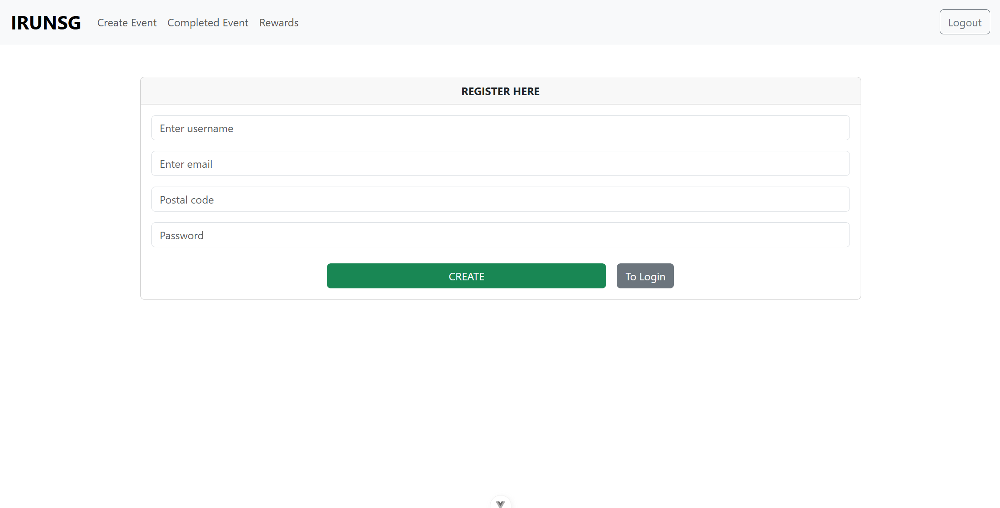
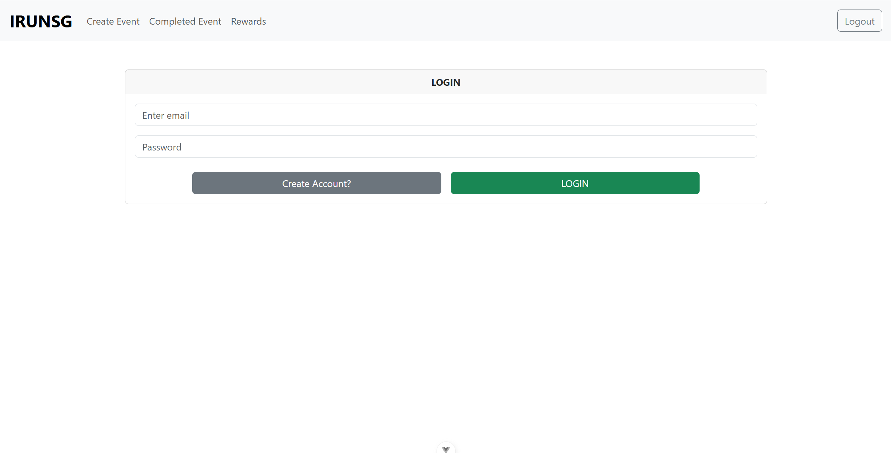
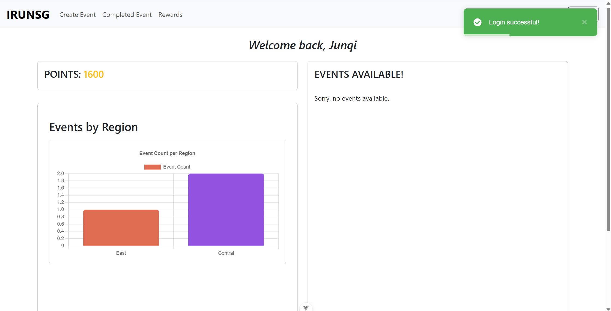
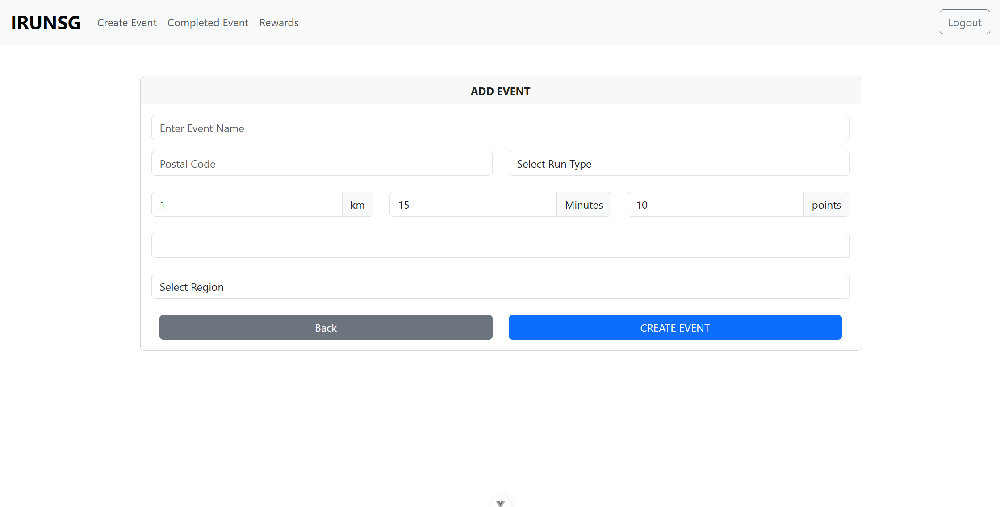
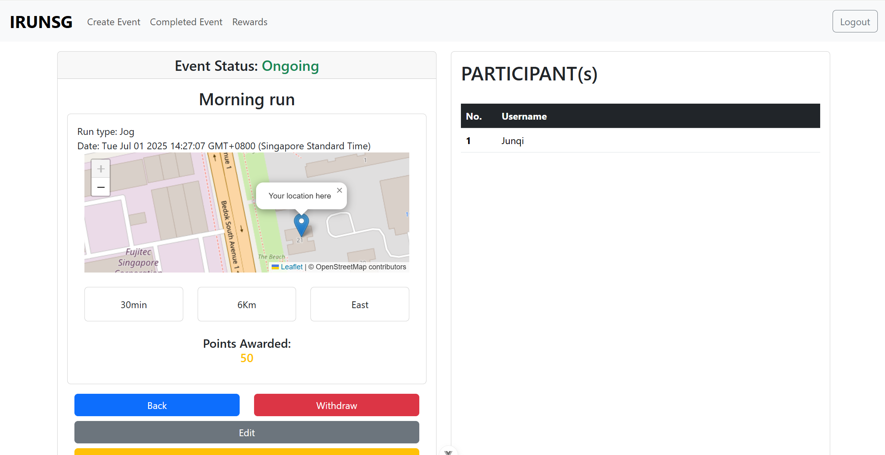
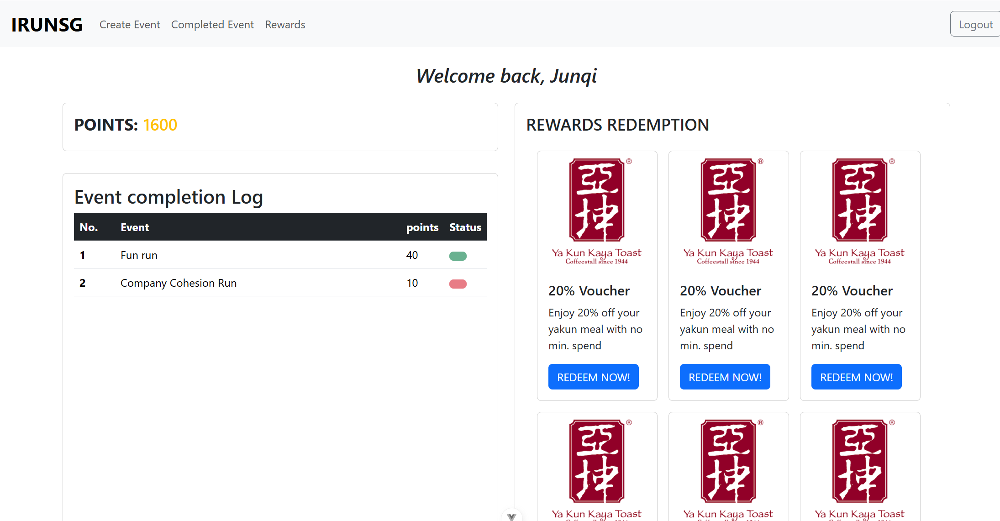

# IRUNSG 🏃

progress - currently 30% done

**IRUNSG** is a full-stack web application built with **Vue.js**, **Express**, and **MongoDB**, designed to bring runners together to discover, organize, and join running events. The platform fosters **community, cohesion, and love for the sport** while offering a reward system that encourages participation.

---
## ScreenShots









## Features

- **Discover Runs Nearby**  
  Find upcoming runs organized by others, sorted by location and region.

- **Join Events & Connect with Other Runners**  
  Participate in events, track attendance, and bond with fellow athletes.

- **Organize Your Own Runs**  
  Create public running events with details like region, distance, and type.

- **Earn Points by Participating**  
  Accumulate points for attending runs or hosting events.

- **Redeem Vouchers**  
  Exchange earned points for vouchers or rewards via the in-app marketplace.


## Tech Stack

| Layer     | Technology    |
|-----------|---------------|
| Frontend  | Vue.js 3, Axios, Chart.js |
| Backend   | Node.js, Express |
| Database  | MongoDB with Mongoose |
| Charts    | Vue Chart.js (v5) + Chart.js (v4) |
| Styling   | Bootstrap 5, SCSS |

---

## Security

- Passwords are hashed using `bcrypt` before being stored in MongoDB.
- Authentication is managed using `JWT` (JSON Web Tokens), issued upon login.
- Secure endpoints require valid tokens in the `x-auth-token` header.

## Getting Started

### Prerequisites

- Node.js & npm
- MongoDB (local or Atlas)

---

### Installation

```bash
# 1. Clone the repo
git clone https://github.com/JunqiChoo/IRUNSG.git

# 2. Install server dependencies
cd server
npm install

# 3. Install client dependencies
cd ../client
npm install
# 4. Running client side
cd ../client
npm run dev

# 4. Running Server side
cd ../backend
npm start


